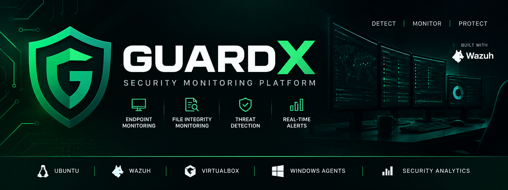
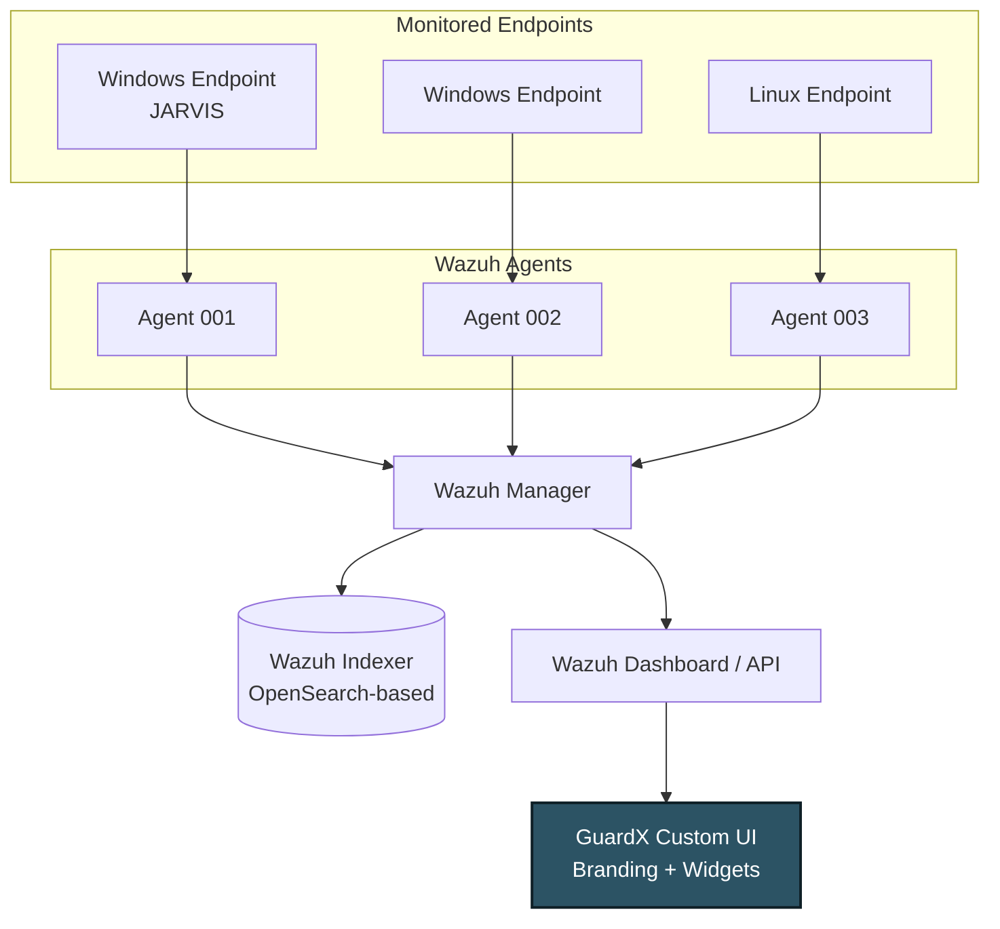

<a name="top"></a>
<div align="center">



<a href="https://git.io/typing-svg">
  
</a>

<br/>


<br/><br/>
**GuardX** is a lightweight, centralized endpoint security monitoring and file-integrity detection platform, built on top of the open-source **[Wazuh](https://wazuh.com)** engine for a B.Tech CSE Cybersecurity mini project.

</div>

---

> 🚧 **Actively in development.** The core Wazuh-based monitoring pipeline is live and verified — endpoint connection, real-time File Integrity Monitoring, and event detection are all working end-to-end. The custom GuardX dashboard and branding layer are being built now.
> **Target launch: within the next 30 days.** ⭐ Star/watch the repo to get notified when it ships.

---

## 🧭 Table of Contents

- [About GuardX](#about-guardx)
- [Problem Statement](#problem-statement)
- [Key Features](#key-features)
- [Architecture](#architecture)
- [Tech Stack](#tech-stack)
- [Screenshots and Demo](#screenshots-and-demo)
- [Getting Started](#getting-started)
- [Roadmap](#roadmap)
- [Verified Results](#verified-results)
- [Limitations](#limitations)
- [Team](#team)
- [Contributing](#contributing)
- [Acknowledgments](#acknowledgments)
- [License](#license)
- [Contact](#contact)

---

## 🎯 About GuardX

Small labs, colleges, and individual setups often lack an affordable, easy-to-use way to get a **centralized view** of endpoint security — file changes, security events, suspicious activity, and alerts, all in one place.

**GuardX** addresses this by using **Wazuh** as the underlying monitoring engine and wrapping it in a purpose-built project identity: a customized interface, dashboard, and workflow designed for clear, simple security demonstrations.

> **Important — technical honesty:** GuardX is **not** a SIEM/EDR engine built from scratch. It is a customized and extended endpoint security monitoring platform built **on top of** the open-source Wazuh engine. Wazuh provides the core detection, agent, and analytics capability; GuardX provides project-specific customization, branding, dashboard design, and integration work on top of it. Core Wazuh security functionality is never altered for the sake of cosmetic branding.

---

## 🧩 Problem Statement

- Traditional endpoint security tools often protect individual machines but don't provide a **centralized view** across a fleet.
- Small organizations, labs, and colleges frequently lack **affordable, easy-to-deploy** security monitoring.
- There's no simple way to see endpoint status, file integrity, and security alerts **in one dashboard** without enterprise-grade tooling.
- GuardX solves this at a lab/demo scale using a proven open-source engine (Wazuh) behind a simplified, purpose-built interface.

---

## ⚡ Key Features

| Feature | Description | Status |
|---|---|---|
| Endpoint Registration & Status | Track connected, disconnected, and pending endpoints | ✅ Working |
| File Integrity Monitoring (FIM) | Real-time detection of file creation, modification, deletion | ✅ Working |
| Security Event Collection | Centralized collection of endpoint security events | ✅ Working |
| Endpoint Information | OS, agent version, agent status, IP details | ✅ Working |
| Centralized Multi-Agent Monitoring | 3–5 endpoints (Windows + Linux) from one server | 🔧 In Progress |
| Security Alert Visualization | Critical / High / Medium / Low severity breakdown | 🔧 In Progress |
| Custom GuardX Dashboard & Branding | Branded UI, theme, logo, and terminology | 🔧 In Progress |
| AI-Assisted Alert Analysis | Advisory-only summaries, risk level, recommendations | 📋 Planned |
| Notifications & Reports | Email/Telegram alerts, automated security reports | 📋 Planned |

---

## 🏗️ Architecture



**Data flow:** `Endpoint → Agent → Manager → Indexer → Dashboard → GuardX Layer`

Each endpoint runs a Wazuh Agent that forwards file-integrity and security events to the central **Wazuh Manager**, which stores them in the **Wazuh Indexer** (OpenSearch-based) and exposes them via the **Wazuh Dashboard/API** — the data source that the custom **GuardX UI** builds on top of.

<details>
<summary>Lab environment details</summary>

| Component | Detail |
|---|---|
| Host | Windows 11 laptop |
| Virtualization | Oracle VirtualBox (NAT networking) |
| Server VM | Ubuntu Server 24.04.4 LTS |
| VM Resources | ~4 GB RAM · ~50 GB disk |
| Server Private IP | `10.0.2.15` |
| Dashboard Access | `https://127.0.0.1:8443` |

</details>

---

## 🧰 Tech Stack

**Core Engine — implemented and running**

    

**GuardX Custom Layer — planned / in progress**

   

> The exact custom frontend/backend choice (React vs. plain HTML/CSS/JS, Node/Express vs. Python FastAPI/Flask) is still being finalized — badges above reflect the options under consideration.

---

## 📸 Screenshots and Demo

<div align="center">


*The custom GuardX dashboard is currently being built. Screenshots and a short demo clip of live FIM detection (file created → modified → deleted, reflected in the dashboard in real time) will be added here as they're ready.*

</div>

---

## 🚀 Getting Started

### Prerequisites
- A host machine capable of running **Oracle VirtualBox**
- **Ubuntu Server 24.04.4 LTS** ISO
- ~4 GB RAM and ~50 GB disk to allocate to the server VM
- A **Windows 11** (or Linux) machine/VM to act as a monitored endpoint

### 1. Set up the GuardX server
- Create an Ubuntu Server 24.04.4 LTS VM in VirtualBox using NAT networking
- Install Wazuh (Manager + Indexer + Dashboard) — follow the [official Wazuh quickstart guide](https://documentation.wazuh.com/current/quickstart.html)
- Configure port forwarding on the host:

| Host Port | Guest Port | Purpose |
|---|---|---|
| 8443 | 443 | Dashboard access |
| 1514 | 1514 | Agent event communication |
| 1515 | 1515 | Agent enrollment |
| 55000 | 55000 | Wazuh API |

- Access the dashboard at `https://127.0.0.1:8443`

### 2. Connect an endpoint
- Install the Wazuh Agent on your Windows/Linux endpoint
- Enroll the agent against the GuardX server
- Confirm the endpoint shows as **Active** in the dashboard

### 3. Enable File Integrity Monitoring
Add a monitored directory to the agent's `ossec.conf`:

```xml
<directories realtime="yes">C:\GuardX-Test</directories>
```

Restart the agent, then create, modify, and delete a file inside that folder — events should appear in the dashboard in real time.

### 4. Run the GuardX dashboard — *coming soon*
Setup instructions for the custom GuardX frontend/backend will be added here once that layer is published.

---

## 🗺️ Roadmap

**Phase 1 — Core Monitoring Pipeline** ✅ *Complete*
- [x] Ubuntu Server 24.04.4 LTS deployed
- [x] Wazuh Manager, Indexer, and Dashboard installed and accessible
- [x] VirtualBox NAT networking and port forwarding configured
- [x] Windows 11 endpoint connected and enrolled (`JARVIS`, Agent 002)
- [x] Real-time FIM enabled on `C:\GuardX-Test`
- [x] File creation, modification, and deletion detection verified end-to-end

**Phase 2 — GuardX Custom Layer** 🔧 *In progress — launching in ~30 days*
- [ ] Custom GuardX-branded dashboard UI
- [ ] Multi-agent support (3–5 endpoints, including a Linux agent)
- [ ] Security alert visualization by severity
- [ ] Centralized endpoint status and information view
- [ ] GuardX theme, logo, favicon, and navigation terminology

**Phase 3 — Stretch Goals** 📋 *Future scope*
- [ ] AI-assisted alert summarization (advisory-only — never autonomous remediation)
- [ ] Automated security report generation
- [ ] Email / Telegram notifications
- [ ] Role-based access control
- [ ] MITRE ATT&CK visualization

<details>
<summary>Full long-term future scope</summary>

- Support for 50+ endpoints
- Linux and macOS agent support
- Mobile endpoint monitoring, where feasible
- Vulnerability management integration
- Threat intelligence integration
- Cloud deployment
- Container monitoring
- Network security monitoring
- Security incident response workflow

</details>

---

## ✅ Verified Results

These are the only results currently reported — obtained from our own lab testing, with nothing fabricated:

- Ubuntu Server deployed; Wazuh Manager, Indexer, and Dashboard running successfully
- Windows 11 endpoint connected and shown as **Active**
- Real-time File Integrity Monitoring enabled on a dedicated `C:\GuardX-Test` directory
- **File creation** correctly detected and logged as *File Added*
- **File modification** correctly detected and logged as *File Modified*
- **File deletion** correctly detected and logged as *File Deleted*

> We intentionally don't report accuracy percentages, detection rates, or performance benchmarks until we run controlled experiments to actually measure them.

---

## ⚠️ Limitations

- Small-scale lab deployment, not a production system
- Built on top of Wazuh — GuardX does not reimplement core SIEM/EDR logic
- Currently tested with a small number of agents (target: 3–5 for the MVP demo)
- Uses VirtualBox NAT networking for the demonstration environment
- The custom GuardX dashboard currently depends on Wazuh's APIs and data
- Any AI-assisted analysis is advisory-only and never takes automated action
- Not intended to replace enterprise SOC infrastructure
- Production use would require stronger authentication, network hardening, backups, and scaling

---

## 👥 Team

| Role | Responsibilities | GitHub |
|---|---|---|
| Backend & Wazuh Infrastructure | Ubuntu server, Wazuh Manager/Indexer, agents, FIM config | `@teammate1` |
| Frontend & Dashboard | GuardX UI, branding, charts, endpoint & alert views | `@teammate2` |
| Research & Documentation | Research paper, literature survey, methodology | `@teammate3` |
| Testing & QA | Test cases, FIM testing, multi-agent testing, results | `@teammate4` |
| Presentation & Demo | Slides, architecture diagrams, demo script | `@teammate5` |

*Replace the placeholders above with your team's actual names and GitHub handles.*

---

## 🤝 Contributing

GuardX is currently a B.Tech CSE academic project, but suggestions, bug reports, and ideas are welcome:

1. Open an [issue](../../issues) describing the bug or suggestion
2. Fork the repo and create a feature branch
3. Submit a pull request with a clear description of your changes

---

## 🙏 Acknowledgments

- **[Wazuh](https://wazuh.com/)** — the open-source security monitoring engine that powers GuardX's endpoint monitoring, FIM, and event collection. All core detection capability shown in this project belongs to the Wazuh project; see their [GitHub repository](https://github.com/wazuh/wazuh) and [official documentation](https://documentation.wazuh.com/) for details.
- Our faculty guide and department for their support and guidance
- The open-source community behind the tools in our custom stack

---

## 📄 License


This project is intended for academic and educational use.

*Update this section once your team finalizes a license. Note that Wazuh itself is distributed under GNU GPLv2 — worth keeping in mind if you redistribute any Wazuh source or configuration files alongside GuardX.*

---

## 📬 Contact

Questions or feedback? Open an [issue](../../issues) or reach out at `guardx.project@example.com`.

<div align="center">

[⬆ Back to top](#top)


</div>
